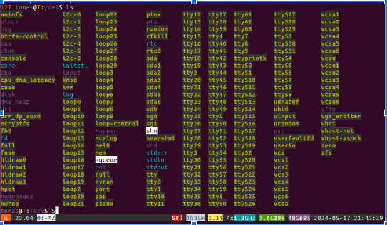

# TP4 - Kernel Modules - Sistemas de Computación 2024
# Integrantes:
- Nestor Jeremías Pasolli
- Alex Agustín Hernando
- Tomás Moyano

## Desafío 1 

### ¿Qué es checkinstall y para qué sirve?

Checkinstall es un programa que monitorea un procedimiento de instalación (como make install, install.sh, etc) y crea un paquete estándar para una distribución de Linux (actualmente se soportan paquetes deb, rpm y tgz) que se puede instalar a través del sistema de gestión de paquetes de la distribución en cuestión (dpkg, rpm o installpkg).

El principal beneficio de CheckInstall contra simplemente ejecutar make install es la habilidad de instalar y desinstalar el paquete del sistema usando el sistema de gestión de paquetes de la distribución de  Linux, además de poder instalar el paquete resultante en varias computadoras fácilmente.

### ¿Se animan a usarlo para empaquetar un hello world? 

Para probar la utilidad de checkinstall creamos un sencillo "Hello world" en C:

```c
#include <stdio.h>

int main() 
{
    printf("Hello, World!\n");
    return 0;
}
```

Luego procedimos a crear el Makefile correspondiente, generando dentro de este la instrucción "install", que luego utilizará Checkinstall para generar el paquete a través del Makefile:

```makefile
TARGET = hello_world
SRCS = hello_world.c
CC = gcc
CFLAGS = -Wall -Werror

all: $(TARGET)

$(TARGET): $(SRCS)
    $(CC) $(CFLAGS) -o $(TARGET) $(SRCS)

install: $(TARGET)
    install -m 0755 $(TARGET) /usr/local/bin/

clean:
    rm -f $(TARGET)
```
Una vez creado el makefile, simplemente resta ejecutar Checkinstall para generar el paquete. En vez de utilizar ```make install``` como haríamos usualmente, ejecutamos ```checkinstall```. Esto utilizará la instrucción "install" dentro del Makefile para generar el paquete (.deb en este caso).
Una vez ejecutado este comando, se nos permite modificar diferentes atributos del paquete a crear, tales como su nombre, descripción, versión, autor, etc, de la siguiente manera:


Una vez terminado este proceso, obtenemos el paquete .deb de nuestro programa:


Y al abrirlo podremos instalarlo a través del sistema de gestión de paquetes (interfaz gráfica):


O bien podemos instalarlo mediante la terminal con el comando ```sudo dpkg -i tp4-kernelmodules_1.0-1_amd64.deb```

### Revisar la bibliografía para impulsar acciones que permitan mejorar la seguridad del kernel, concretamente: evitando cargar módulos que no estén firmados

En primer lugar, para evitar la carga de módulos no firmados en el kernel se debe habilitar el arranque seguro (secure boot) desde la BIOS o UEFI:


De esta manera al intentar cargar un módulo que no esté firmado el SO nos lo impedirá:


Para poder firmar el módulo y que sea posible utilizarlo en la PC se debe hacer lo siguiente:

1) Crear ekl archivo de condfiguración con parámetros para la generación de claves (claves ssh, una pública y otra privada):


2) Crear el par de claves (pública y privada) con los siguientes comandos:


```bash
$ openssl req -x509 -new -nodes -utf8 -sha256 -days 36500 \
$ -batch -config configuration_file.config -outform DER \
$ -out my_signing_key_pub.der \
$ -keyout my_signing_key.priv
```


3) Para corroborar que se realizó correctamente el proceso, se puede chequear la validez de las claves, de la siguiente manera:

```bash
$ openssl x509 -inform der -text -noout -in my_signing_key_pub.der
```


4) Agregamos la clave pública al sistema utilizando mokutil:

```bash
$ mokutil --import my_signing_key_pub.der
```


5) Debemos permitir que se agregue la llave pública con la herramienta MOK, que se ejecutará cuando reiniciemos el sistema:


6) Finalmente, con el siguiente comando firmamos el módulo:

```bash
$ sudo /usr/src/kernels/$(uname -r)/scripts/sign-file sha256 my_signing_key.priv my_signing_key_pub.der part1/module/mimodulo.ko
```

Una vez hechos estos pasos, ya es posible cargar el módulo firmado:


## Desafío 2

Debe tener respuestas precisas a las siguientes preguntas y sentencias:

### ¿Cómo empiezan y terminan unos y otros (programas y módulos)?

Un programa generalmente comienza con la funcion `main()`, esto depende del lenguaje y de la implementacion, luego ejecuta una serie de instrucciones y termina despues de completarlas.

Un modulo siempre comienza con la funcion `module_init` o una funcion designada por la llamada `module_init`. Esta funcion notifica al kernel sobre las funcionalidades del modulo, preparandolo para que pueda llamarse al modulo cuando se lo requiera. Los modulos concluyen invocando `cleanup_module` o una funcion especifica a travez de la llamada `module_exit` con lo cual se desregistran las funcionalidades, por lo cual la funcion de entrada y de salida es obligatoria para un modulo.

```c
module_init(hello_init); 
module_exit(hello_exit); 
```

### ¿Qué funciones tiene disponible un programa y un módulo?

El kernel de Linux es modular:  permite insertar y eliminar código bajo demanda con el fin de añadir o quitar una funcionalidad. 

Los modulos son esenciales porque proporcionan la flexibilidad necesaria para extender las capacidades del sistema operativo sin necesidad de recompilar todo el kernel. 

  * Funcionalidades que podemos añadir con módulos:
    * Drivers privativos de hardware para gráficos / tarjetas de red.
    * Registrar temperaturas de componentes del ordenador y gestion del hardware.
    * Optimizacion del hardware.

  * Funcionalidades que tiene disponible un programa:
    * Gestión de Archivos/Procesos/Memoria.
    * Interacción con el Hardware.
    * Redes, establecimiento de conexiones, envío/recepción de paquetes.
    * Interfaz de Usuario.
    * etc.

#### Observaciones acerca de las funcionalidades:

  Los programas normalmente invocan funciones en donde muchas de sus definiciones no entran en el programa hasta la etapa de enlazado ej: `printf()` lo cual asegura que la funcion este disponile y apunta la llamada a la biblioteca estandar de C.

  Los módulos del kernel son diferentes en este aspecto. los módulos son archivos de objeto cuyos símbolos se resuelven al ejecutar insmod o modprobe. La definición de los símbolos proviene del propio kernel; las únicas funciones externas que se pueden usar son las proporcionadas por el kernel. Los símbolos exportados por el kernel se encuentan en /proc/kallsyms

  Incluso se pueden escribir módulos para reemplazar las llamadas al sistema del kernel, como hacer que el kernel escriba "¡Ja ja, eso hace cosquillas!" cada vez que alguien intente eliminar un archivo del sistema sin los permisos adecuados.


### Espacio de usuario y Espacio del kernel:

El kernel gestiona principalmente el acceso a los recursos, ya sea una tarjeta de video, un disco duro o la memoria. Los programas frecuentemente compiten por los mismos recursos. El kernel tiene como objetivo mantener el orden, asegurando que distintos programas no accedan a los recursos de manera indiscriminada.

 Unix utiliza solo dos anillos o niveles: el anillo más alto (anillo 0, también conocido como "modo supervisor", donde todas las acciones son permisibles) y el anillo más bajo, referido como "modo usuario".

Para verlo mas claro, pongamos un ejemplo. Una función de una biblioteca realiza una o más llamadas al sistema, y estas llamadas al sistema se ejecutan en nombre de la función de biblioteca, pero lo hacen en “supervisor mode” ya que son parte del propio kernel. Una vez que la llamada al sistema completa su tarea, regresa y la ejecución se transfiere de nuevo al “user mode”.

### Espacio de datos

El "espacio de datos" hace referencia a la manera en que el sistema gestiona, organiza y almacena datos, tanto en memoria como en disco (almacenamiento secundario).

#### Memoria Virtual y Física

El SO mantiene un esquema de memoria virtual para gestionar cómo los procesos acceden a la memoria física. Cada proceso se ejecuta en su propio espacio de direcciones virtuales, lo que significa que cada proceso piensa que tiene acceso a toda la memoria del sistema, aunque en realidad comparte la memoria física con otros procesos.

#### Segmentación de Memoria

El espacio de datos de un proceso se segmenta en varias regiones principales:

- Código (text segment): Contiene el código ejecutable del programa.
- Datos estáticos (data segment): Contiene variables globales y estáticas que se inicializan.
- Datos no inicializados (BSS segment): Contiene variables globales y estáticas que no se inicializan.
- Heap: Área de memoria dinámica que se utiliza para la asignación dinámica durante la ejecución del programa (usando malloc, por ejemplo).
- Stack: Utilizado para la ejecución de llamadas a funciones y almacenamiento de variables locales.

#### Sistema de Archivos

El espacio de datos en disco se gestiona a través del sistema de archivos del SO. Para el caso de GNU/Linux, el sistema de archivos más comun es ext4.

- Inodos: Cada archivo tiene un inodo que contiene metadatos sobre el archivo (permisos, propietario, tamaño, etc.).
- Bloques: Los datos de los archivos se almacenan en bloques en el disco.
- Directorio: Los archivos se organizan en una estructura jerárquica de directorios.

#### Gestión de Memoria

El kernel gestiona la memoria mediante varias técnicas:

- Paginación (paging): La memoria se divide en páginas de tamaño fijo (típicamente 4 KB). El sistema puede intercambiar páginas entre la RAM y el espacio de intercambio (swap) en el disco.
- Segmentación: Aunque menos común en sistemas modernos, se puede segmentar la memoria para distintos propósitos y procesos, a diferencia de la paginación, la segmentación permite dividir la memoria en segmentos de tamaño variable.
- Caché y Buffers: El SO utiliza el caché y los buffers para mejorar el rendimiento del acceso a disco.

#### Intercambio de Datos y Comunicación Inter-procesos (IPC)

Para la comunicación entre procesos y la transferencia de datos, Linux ofrece varias técnicas de IPC:

- Tuberías (pipes) y Tuberías con nombre (named pipes): Para la comunicación de datos en una sola dirección.
- Colas de mensajes: Permiten que los procesos envíen y reciban mensajes.
- Memoria compartida: Permite que varios procesos accedan a una misma región de memoria.
- Semáforos: Para la sincronización entre procesos.

#### Seguridad y Permisos

El espacio de datos en Linux está protegido mediante un sistema de permisos y políticas de seguridad:

- Permisos de archivos: Lectura, escritura y ejecución pueden ser configurados para el propietario, grupo y otros usuarios.
- Control de acceso obligatorio (MAC): Sistemas como SELinux implementan políticas de seguridad estrictas sobre qué procesos pueden acceder a qué recursos.

### Drivers. Investigar contenido de /dev.

Un driver o controlador es un programa que actúa como intermediario entre el sistema operativo y un dispositivo de hardware. Los drivers traducen las instrucciones del sistema operativo a un formato que el hardware puede entender y viceversa.

#### Tipos de Drivers en Linux

En Linux, los drivers se clasifican principalmente según el tipo de hardware que controlan:

- Drivers de dispositivos de bloque: Para dispositivos que leen y escriben datos en bloques, como discos duros y unidades SSD.
- Drivers de dispositivos de caracter: Para dispositivos que manejan datos en forma de flujo de caracteres, como puertos seriales y teclados.
- Drivers de red: Para interfaces de red, como tarjetas Ethernet y WiFi.
- Drivers gráficos: Para tarjetas de video y otros dispositivos de visualización.
- Drivers de sonido: Para tarjetas de sonido y otros dispositivos de audio.
- Drivers de dispositivos USB y periféricos: Para una amplia variedad de dispositivos conectados a través de USB.

Otra clasificación de los drivers es la siguiente:

- Repositorio de Kernel: Los drivers abiertos se incluyen en el repositorio principal del kernel y están disponibles para todas las distribuciones.
- Drivers Privativos: Algunos fabricantes proporcionan drivers binarios que no están incluidos en el kernel principal. Estos pueden ser descargados directamente desde el sitio web del fabricante o a través de gestores de paquetes de la distribución.

#### Gestión de Drivers en Linux

El manejo de drivers en Linux incluye la instalación, carga, descarga y configuración. Aquí están las herramientas y métodos más comunes:

- `lsmod`: Muestra los módulos del kernel actualmente cargados.
modprobe: Carga módulos del kernel y sus dependencias.
- `insmod`: Inserta un módulo en el kernel.
- `rmmod`: Elimina un módulo del kernel.

### Contenido del directorio /dev

El directorio /dev contiene archivos que representan dispositivos físicos y virtuales en el sistema. Estos archivos de dispositivos permiten a los programas interactuar con el hardware mediante operaciones de lectura y escritura, similar a como interactuarían con archivos regulares.

#### Tipos de Dispositivos en /dev

En /dev, los archivos de dispositivos se clasifican en dos categorías principales:

#### Dispositivos de Bloque (Block Devices):

Descripción: Estos dispositivos manejan datos en bloques, que son unidades de datos de tamaño fijo.
Ejemplos: Discos duros, unidades SSD, y particiones.
Identificación: Generalmente tienen nombres como sda, sda1, sdb, etc.
Uso: Estos dispositivos son utilizados para operaciones de entrada/salida de gran volumen y permiten el acceso aleatorio a los datos.

#### Dispositivos de Carácter (Character Devices):

Descripción: Estos dispositivos manejan datos en flujos de caracteres.
Ejemplos: Teclados, ratones, puertos serie, y consolas.
Identificación: Generalmente tienen nombres como tty0, ttyS0, random, null, etc.
Uso: Estos dispositivos son utilizados para operaciones de entrada/salida de baja latencia y permiten el acceso secuencial a los datos.

Podemos saber si un dispositivo es de cada tipo ejecutando el comando `ls -l`, y observando la primera letra de cada dispositivo listado: 
- c -> character
- b -> block




#### Dispositivos Comunes en /dev

- /dev/null: Un dispositivo especial que descarta cualquier dato escrito en él. Leer desde /dev/null siempre devuelve un EOF (End Of File).
- /dev/zero: Un dispositivo especial que proporciona un flujo de ceros. Es útil para inicializar datos.
- /dev/random y /dev/urandom: Dispositivos que generan números aleatorios. /dev/random puede bloquearse si no hay suficiente entropía, mientras que /dev/urandom no se bloquea y es menos seguro.
- /dev/sda, /dev/sdb, etc.: Representan discos duros y dispositivos de almacenamiento.
- /dev/tty, /dev/tty0, /dev/ttyS0, etc.: Representan terminales y puertos serie.
- /dev/loop0, /dev/loop1, etc.: Dispositivos de loopback que permiten montar archivos como si fueran discos.
- /dev/cdrom, /dev/dvd: Representan unidades de CD/DVD.

## Preguntas finales

Ejecutamos el paso a paso para cargar y descargar el módulo de ejemplo del repositorio en el kernel, de la siguiente manera:

```bash
$ cd part1/module
$ make
$ sudo insmod mimodulo.ko
$ sudo dmesg
$ lsmod | grep mod
$ sudo rmmod mimodulo
$ sudo dmesg
$ lsmod | grep mod
$ modinfo mimodulo.ko
$ modinfo /lib/modules/$(uname -r)/kernel/crypto/des_generic.ko
```
En las siguientes imágenes se observan los resultados de los comandos:


Extracto del comando `sudo dmesg`:


Extracto del comando `sudo dmesg` luego de remover el módulo:


Y los respectivos comandos `modinfo`:


### ¿Qué diferencias se pueden observar entre los dos modinfo?

El módulo des_generic.ko proporciona una implementación del algoritmo DES (Data Encryption Standard) para ser utilizado dentro del kernel de Linux. Esto permite que el cifrado DES sea utilizado por otras partes del kernel, como el subsistema de criptografía (Crypto API) y puede ser aprovechado por aplicaciones que necesitan realizar operaciones criptográficas a nivel del kernel. Por otro lado, mimodulo.ko es un simple ejemplo que escribe un mensaje indicando si fue cargado/descargado del kernel.

En primer lugar notamos que el módulo "des_generic.ko" posee varios alias asociados, lo que nos da distintas formas de accederlo en caso de necesitarlo. Además, contiene como dependencia la librería "libdes".

La otra gran diferencia es que este módulo propio del kernel esta firmado, por lo que se puede considerar seguro, mientras que nuestro ejemplo no lo está. De igual manera, siguiendo el procedimiento ya mencionado se puede firmar de manera similar.

### ¿Qué divers/modulos estan cargados en sus propias pc? Analizar diferencias entre las PCs de cada integrante

En los siguientes archivos se listan los módulos cargados en cada PC de los integrantes del grupo, obntenidos mediante el comando `lsmod`:

- [Módulos en PC de Jeremías Pasolli (escritorio)](./txtFiles/lsmod_Jeremias_Original.txt)
- [Módulos en PC de Agustín Hernando (notebook)](./txtFiles/lsmod_Agustin_Original.txt)
- [Módulos en PC de Tomás Moyano (notebook)](./txtFiles/lsmod_Tomas_Original.txt)

Mediante la utilización del comando `awt` filtramos la primera columna de los archivos, para obtener únicamente los nombres de los módulos. Luego los ordenamos alfabéticamente, para mayor precisión en el posterior paso, en el cual ejecutamos el comando `diff` entre los archivos.

De esta manera, mediante el comando:
```bash
 $ awk 'NR==1 {next} {print $1}' lsmod_nombreIntegrannte_Original.txt > lsmod_nombreIntegrante_Clean.txt
 ```

filtramos la primer columna, obteniendo:

- [Módulos en PC de Jeremías Pasolli (escritorio, filtrado)](./txtFiles/lsmod_Jeremias_Clean.txt)
- [Módulos en PC de Agustín Hernando (notebook, filtrado)](./txtFiles/lsmod_Agustin_Clean.txt)
- [Módulos en PC de Tomás Moyano (notebook, filtrado)](./txtFiles/lsmod_Tomas_Clean.txt)

y luego, mediante:

```bash
sort lsmod_nombreIntegrante_Clean.txt > lsmod_nombreIntegrante_Sorted.txt
```

obtenemos los tres archivos filtrados y ordenados para mayor claridad:

 - [Módulos en PC de Jeremías Pasolli (escritorio, filtrado y ordenado)](./txtFiles/lsmod_Jeremias_Sorted.txt)
- [Módulos en PC de Agustín Hernando (notebook, filtrado y ordenado)](./txtFiles/lsmod_Agustin_Sorted.txt)
- [Módulos en PC de Tomás Moyano (notebook, filtrado y ordenado)](./txtFiles/lsmod_Tomas_Sorted.txt)

Finalmente ejecutamos el comando diff entre archivos para ver las diferencias. Se presentan archivos con las diferencias encontradas entre los módulos listados por cada PC:

- [Diferencia entre PC de Jeremías Pasolli y Agustín Hernando](./txtFiles/diff_Agustin_Jeremias.txt)
- [Diferencia entre PC de Jeremías Pasolli y Tomás Moyano](./txtFiles/diff_Tomas_Jeremias.txt)
- [Diferencia entre PC de Agustín Hernando y Tomás Moyano](./txtFiles/diff_Tomas_Agustin.txt)

Analizando los archivos con las diferencias logramos ver que hay muchas similitudes entre los módulos de las PCs. Sin embargo, y como era de esperarse, encontramos también diferencias en menor medida. Esto se debe a las diferencias de hardware entre las PCs, ya que vemos que las diferencias surgen en módulos encargados de controlar hardware que es muy diferente entre una PC y otra, como por ejemplo controladores de placas de video (nvidia vs amd), distintos módulos correspondientes al CPU de cada PC (diferentes arquitecturas de ), controladores de placas de audio, controladores de teclado/mouse, controladores de dispositivos de almacenamiento (SATA vs NVME), etc.

### ¿Cuáles módulos no están cargados pero están disponibles? ¿Qué pasa cuando el driver de un dispositivo no está disponible?

Para saber los módulos que tenemos disponibles para nuestro kernel ejecutamos el siguiente comando, buscando los archivos ".ko" en el directorio correspondiente a la versión del kernel.

```bash
find /lib/modules/$(uname -r)/kernel -type f -name '*.ko*'
```
Y para saber los módulos que efectivamente están cargados podemos utilizar `lsmod`.

Mediante el siguiente script, disponible en el archivo [loaded_vs_available_modules.sh](./loaded_vs_available_modules.sh), podemos comparar la lista de módulos disponibles vs la de módulos cargados, obteniendo como impresión en pantalla los módulos disponibles pero no cargados:

```bash
# Obtener la lista de módulos cargados
loaded_modules=$(lsmod | awk '{print $1}' | tail -n +2)

# Obtener la lista de módulos disponibles
available_modules=$(find /lib/modules/$(uname -r)/kernel -type f -name '*.ko*' | xargs -n 1 basename | sed 's/.ko.*//')

# Comparar las dos listas y encontrar los módulos disponibles pero no cargados
for module in $available_modules; do
    if ! echo "$loaded_modules" | grep -qw "$module"; then
        echo "$module"
    fi
done
```

Al observar la salida de este script, notamos que hay una gran cantidad de módulos disponibles pero no cargados en el kernel, de funcionalidades muy variadas. Esto es así ya que es justamente el objetivo de la modularidad del kernel, que le permite ser más flexible y agregar o quitar funcionalidades cuando sea necesario, cargando y descargando módulos respectivamente. Además, esto permite compatibilidad con una amplia cantidad de hardware de diferentes fabricantes, he aquí otra razón por la que muchos módulos no están cargados. El kernel se encarga automáticamente de cargar y descargar los módulos necesarios. También, de así desearlo, podemos hacerlo manualmente mediante la herramienta `udev`. Además, cargar todos los módulos al arrancar el sistema resultaría en un alto consumo de recursos de manera innecesaria, por lo que la carga/descarga dinámica es lo más eficiente para el sistema.

### Correr hwinfo en una pc real con hw real y agregar la url de la información de hw en el reporte

Este comando ofrece un reporte extenso y detallado sobre el hardware que está funcionando en una PC en el momento en el que se ejecuta. En el archivo [hw_info_pc.txt](./txtFiles/hw_info_pc.txt) se encuentra el reporte de hardware de una PC del grupo.

### ¿Qué diferencia existe entre un módulo y un programa? 


La diferencia entre un módulo del kernel de Linux y un programa común es principalmente la manera en que interactúan con el sistema.

Los módulos del kernel están diseñados para extender la funcionalidad del kernel de Linux. Son utilizados para agregar soporte para hardware específico, sistemas de archivos, protocolos de red, y otras funcionalidades que deben operar a nivel del sistema. Proporcionan servicios esenciales y de bajo nivel, como el manejo de dispositivos, controladores de hardware, y funciones críticas del sistema que requieren acceso directo a los recursos del hardware. Además, operan en el espacio del kernel, lo que les permite tener acceso directo y sin restricciones a los recursos del hardware y a las estructuras internas del kernel. Debido a su alto nivel de acceso, errores o vulnerabilidades en los módulos del kernel pueden causar caídas del sistema, corrupción de datos, o brechas de seguridad.


Por otro lado, los programas están diseñados para realizar tareas de usuario o aplicaciones específicas. Operan en el espacio de usuario y no interactúan directamente con el hardware. Utilizan servicios proporcionados por el kernel para realizar sus tareas. Operan en el espacio de usuario, que está separado del espacio del kernel. Esto protege al sistema de fallos potenciales y aumenta la seguridad.

Otra diferencia importante ya mencionada en respuesta anteriores es que los módulos sólo pueden utilizar funciones externas que sean provistas por el kernel.

### ¿Cómo puede ver una lista de las llamadas al sistema que realiza un simple helloworld en c?

Para lograr esto podemos utilizar la herramienta `strace`, que intercepta y registra todas las llamadas al sistema que realiza un proceso particular. Al correr este comando con nuestro [hello_world](./hello_world.c), previamente compilado, obtenemos la siguiente salida:


Donde podemos ver cómo un programa tan simple como este hace múltiples llamadas al sistema, tales como:

- execve: Llama a execve para ejecutar el programa.
- brk: Ajusta el límite del segmento de datos.
- mmap: Mapea archivos o dispositivos en memoria.
- access: Comprueba la existencia del archivo /etc/ld.so.preload.
- openat: Abre archivos necesarios, como bibliotecas compartidas.
- fstat: Obtiene el estado de un archivo.
- write: Escribe "Hello, World!\n" en la salida estándar (descriptor de archivo 1).
- exit_group: Finaliza el programa.

### ¿Qué es un segmentation fault? como lo maneja el kernel y como lo hace un programa?

Un segmentation fault (fallo de segmentación) es un tipo de error que ocurre cuando un programa intenta acceder a una memoria que no tiene permiso para acceder. Este acceso ilegal puede ser debido a diversas razones, como intentar leer o escribir en una dirección de memoria fuera del espacio de direcciones asignado al proceso, acceder a una memoria liberada, desreferenciar un puntero nulo, etc.

#### ¿Cómo Maneja el Kernel un Segmentation Fault?

Detección:

El hardware de la CPU tiene mecanismos de protección de memoria que generan una excepción cuando se produce un acceso de memoria inválido.
La Unidad de Gestión de Memoria (MMU) de la CPU detecta el acceso ilegal y genera una interrupción, señalando al kernel que se ha producido una violación de segmentación.

Interrupción y Señalización:

El kernel recibe la interrupción y determina que ha ocurrido un fallo de segmentación.
El kernel envía una señal SIGSEGV (segmentation violation) al proceso que causó la violación de memoria.

Terminación del Proceso:

Si el proceso no maneja la señal SIGSEGV, el comportamiento predeterminado del kernel es terminar el proceso y generar un core dump (si está configurado para hacerlo). Un core dump es un volcado de la memoria del proceso en el momento del fallo, que puede ser útil para depuración.

#### ¿Cómo Maneja un Programa un Segmentation Fault?

Manejo de Señales:

Un programa puede manejar la señal SIGSEGV que envía el kernel al detectar el fallo de segmentación, registrando un manejador de señales (signal handler), usando la función signal o sigaction en C.

Depuración:

Durante el desarrollo, un core dump generado por un segmentation fault puede ser analizado con herramientas como gdb (GNU Debugger) para determinar la causa del fallo.

#### ¿Qué pasa si mi compañero con secure boot habilitado intenta cargar un módulo firmado por mi?

En primera isntancia, si un compañero intenta cargar un módulo firmado por mí con secure boot habilitado en su PC, el kernel no le permitirá hacerlo, ya que su PC no cuenta con la llave pública correspondiente a la llave privada con la que yo firmé previamente el módulo.

Para que él pueda cargarlo correctamente, primero debería agregar en su sistema mi llave pública. Una vez hecho esto, el kernel permitirá cargar el módulo firmado por mí, ya que conocerá la llave pública correspondiente.
